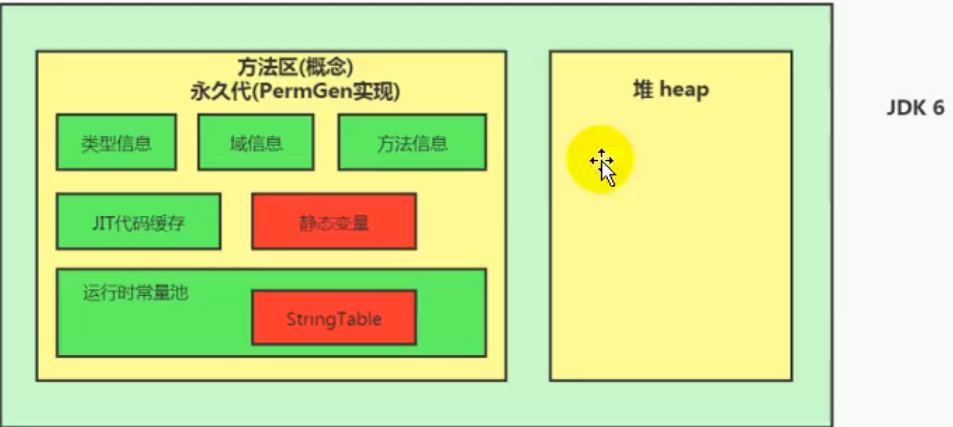

# String Table

## String的基本特征

#### 1.JDK8之前，String类底层为char[]，之后为byte[]+编码集标识

###### 这是针对Latin及ISO-8859-1 一个字节就能存的下的情况改进的，但同时也会给个标识符，像中文UTF-16就还是用两个字节存储

#### 2.字面量定义的方式， 创建的String会存储在字符串常量池中

###### new的对象则在堆中

###### 不可变性

###### s1="hello"与s1+="def"都会重新在常量池中造一个

#### 3.字符串常量池不会存储相同内容字符串 

###### 类似map、set ，因为String Pool是一个固定大小的Hashtable，jdk6默认长度是1009（无最小值），jdk7默认长度是60013（无最小值），jdk8默认长度是60013（最小值为1009）

###### 长度的增大是因为要避免哈希冲突产生的链表

###### 可使用-XX:StringTableSize=？设置StringTable的长度

#### 4.data.intern()

###### 如果字符串常量池中没有对应data的字符串，则在常量池中生成

###### 常量池大小越大，在实际开发中，intern()速度越快

## String的内存分配

#### 字符串常量池位置：jdk6在永久代中，

#### jdk7在Java堆内

#### jdk8元空间取代永久代，使用的是JVM外的内存，StringTable仍然在堆

为什么要用元空间？

①permSize比较小

②永久代存放的是类信息，垃圾回收频率低

③使用直接内存不用担心OOM异常？

## 字符串拼接操作

#### 原理：编译期优化 

###### 常量与常量的拼接结果在常量池，如s1="a"+"b"+"c"，等同于s1="abc"

#### 原理：StringBuilder

###### 只要拼接中有一个是变量，结果就在堆中

①先new 一个StringBuilder(length) ，c为底层char[]的长度

②多次加载并调用append方法

③调用toString()方法：类似于直接new了一个String，所以新造对象在堆中  

补充：5.0之前是用的StringBuffer，5.0之后用的是StringBuilder

注意：一个变量被final修饰则变成常量了，属于常量引用情况，原理也为编译期优化，所以尽量使用final，可节省空间

## intern()

#### intern()简介

如果字符串常量池中不存在此字符串，则添加并返回地址， **但在jdk7及之后，StringTable放在堆中，执行intern()时，不再去往字符串常量池中添加具体对象，而是直接在常量池中维护源字符串的地址**；有则返回地址即可

#### 前导知识

**new String("ab")会造几个对象？** 

通过看底层字节码指令，会创建两个对象，一个在ldc常量池，一个在堆中（通过new关键字在堆空间创建的）

**new String("a")+new String("b")会造几个对象？**

一共六个对象：

①new StringBuilder() 

②new String("a") 

③常量池中的"a"

④new String("b")

⑤字符串常量池中的"b"

⑥new StringBuilder 底层的new String("ab")，**但此方法与前面的new String("a")不同，并没有在常量池中添加**

#### 重要面试题

###### 代码

###### 图示

jdk7

jdk6

######  总结

###### 对于程序中大量存在的字符串，尤其其中存在很多重复字符串时，使用intern()能大大节省空间

大的网站平台，很多人都存储重复信息，如地址等，用intern()可大大节省空间

#### G1中的String去重操作

